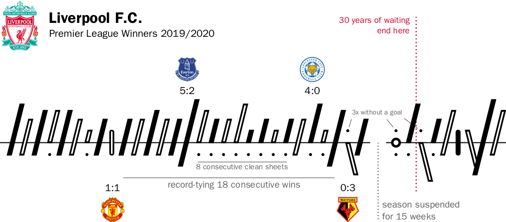

# soccerbars
A LaTeX package for word-sized tallies  of association football results. Suitable for use in league tables and reporting. Can be enlarged for historic achievements:

## Using the Package

Place the file [`soccerbars.sty`](soccerbars.sty) in a directory where LaTeX can find it, and `\usepackage{soccerbars}` in the preamble of a document. The first `\soccerbar{(2-0)}` looks like an easy win, but turns into a loss `\soccerbar{(2-0),(2-0)*}` if marked as an away match. The rest is details and explained in the documentation ([pdf](doc/soccerbars.pdf?raw=true)).

This package can be used freely under [*The LaTeX Public Project License*](LICENSE.md).
Additional [implementations for python and R](https://github.com/snlab-eakbiyik/soccerbars) are provided by Eren Akbiyik.

## References

Soccerbars are instances of gestaltlines, which in turn generalize sparklines to multivariate sequences.
* Tufte (2006). [*Beautiful Evidence*](https://www.edwardtufte.com/tufte/books_be). Graphics Press
* Brandes, Nick, Rockstroh & Steffen (2013). [Gestaltlines](https://doi.org/10.1111/cgf.12104). *Computer Graphics Forum* 32(3):171-180.

## Credits

Lukas Knoflach contributed to prototyping while visiting ETH Zürich in 2020. 
