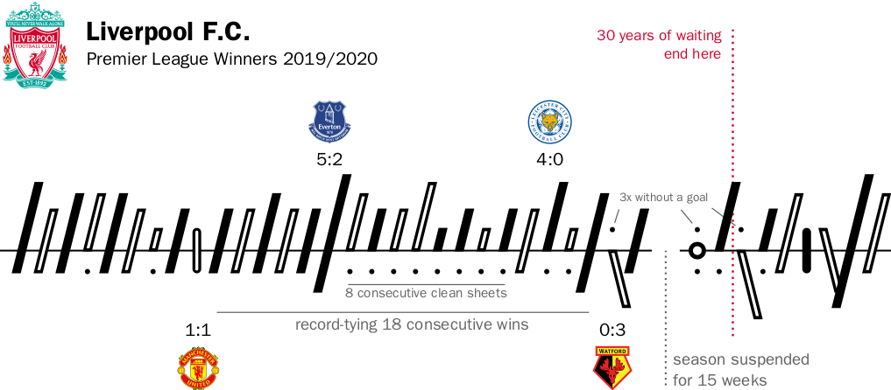

# soccerbars
A LaTeX package for word-sized tallies of association football results.



## Using the Package

Place the file [```soccerbars.sty```](soccerbars.sty) in a directory where LaTeX can find it and ```\usepackage{soccerbars}``` in the preamble of a document. With ```\soccerbar{(2-1)}``` you can score your first win; away matches may be more challenging, ```\soccerbar{(2-1),(1-1)*}```. The rest is details and explained in the [package documentation](doc/soccerbars.pdf) (pdf).
